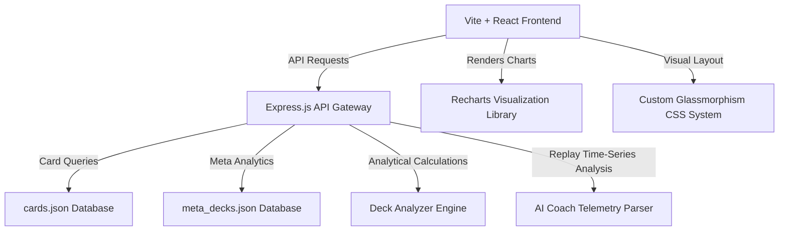

# AI-Powered Clash Royale Analytics Platform

An advanced full-stack data analytics and performance platform for Clash Royale, designed to showcase **Data Analysis, API Engineering, System Design, and UI/UX**.

> [!NOTE]
> This project operates as a complete, out-of-the-box local data engine. It avoids external Clash Royale API key requirements (which require restrictive server-IP whitelisting) by deploying highly detailed, curated offline card databases and match replay telemetry engines.

---

## 🚀 Core Features & Modules

### 1. Deck Strength Analyzer
*   **Elixir Curve Profile**: Computes the exact average elixir cost of an 8-card deck.
*   **Archetype Coverage Checklist**: Validates that the deck satisfies standard competitive requirements:
    *   *Win Condition* (to damage towers)
    *   *Tank Killer* (high single-target DPS to melt Giants/Pekkas)
    *   *Air Defense* (minimum 2 cards targeting air units)
    *   *Spells* (Small damage and Big damage spells)
*   **Metric Radar Meters**: Evaluates and visualizes ratings (0-10) for **Ground Defense, Tower Offense, Versatility, and Synergy**.
*   **Dynamic Replacement Suggestion**: Select any card in the deck and get 3 statistical recommendations for replacements, with detailed tactical reasoning (e.g. *"Lowers average elixir by 0.125 to speed up cycle speed"*).

### 2. Meta Tracker Dashboard
*   **Key Performance Indicators (KPIs)**: Highlights Most Popular Card, Top Win-Rate Deck, Dominant Archetype, and Average Meta Elixir.
*   **Card Usage Distribution**: A bar chart mapping the top 10 most popular meta cards.
*   **Archetype Performance Trends**: A multi-line chart tracking win-rates of primary archetypes (Beatdown, Cycle, Bridge Spam, Spell Bait) across leagues (Mid Ladder, Top Ladder, Grand Challenges, CRL Pro).
*   **Elixir Cost vs Win-Rate Correlation**: A scatter plot displaying the relationship between card cost and meta win-rate, with bubble sizes scaled by card popularity.

### 3. Synergy Recommendation Engine
*   **Constraints-Based Filtering**: Filter available card suggestions by current Arena Level unlock limits (Arena 0 to 12+).
*   **Locked Core Selection**: Specify up to 3 "must-have" cards.
*   **Greedy Role Builder Algorithm**: If no exact meta deck match is found, an algorithmic engine builds a deck from scratch. It weights missing roles (e.g. +40 for air defense if counts < 2), calculates candidate card synergies, checks elixir balance offsets, and returns a cohesive custom deck.

### 4. AI Performance Coach
*   **Match Telemetry Curve**: A dual-axis area-line chart graphing Player Elixir vs Opponent Elixir over the course of a 3-minute match. Hovering over a timestamp displays cards played and elixir costs.
*   **Resource Efficiency Grade**: Evaluates an efficiency rating (A to F) based on **Elixir Leakage** (spent time sitting idle at 10 elixir).
*   **Mistake Detectors**: Scans the match log for tactical errors:
    *   *Overcommitments*: Spamming high-cost threat cards into known counters.
    *   *Negative Trades*: Deploying swarms directly onto active splashers.
    *   *Macro Errors*: Dropping slow high-cost tanks in single elixir while opposite lanes are pressured.
*   **Tactical Drills**: Outputs a set of actionable coaching instructions tailored to the errors made in the match.

---

## 🛠 Tech Stack & Architecture



*   **Frontend**: React (Vite), Recharts, Lucide Icons, Vanilla CSS with custom theme variables.
*   **Backend**: Node.js, Express.js, Body-Parser, CORS.
*   **Database**: JSON-based high-fidelity relational modeling.

---

## 🧮 Data Analytics & Heuristics

### A. Synergy Score Heuristic
The deck synergy score (scaled $10$ to $100$) is computed as:
$$\text{Synergy Score} = 50 + (\text{Synergy Pairs} \times 8) - \text{Penalties}$$
*Penalties are applied if the deck lacks a Win Condition (-15), lacks air defense (-10), has no spells (-10), or has an imbalanced average elixir (-10).*

### B. Replacement Scoring Heuristic
Candidate replacement cards are scored based on:
1.  **Role Preservation**: $+40$ if candidate matches the role of the card being replaced.
2.  **Missing Requirement Compensation**: $+50$ if the candidate resolves a completely missing role (e.g. adding a Win Condition).
3.  **Synergy Change**: $+12$ per direct synergy connection formed with the other 7 cards in the deck.
4.  **Elixir Optimization**: $+10 \times (1.5 - |\text{New Average Elixir} - 3.4|)$.
5.  **Baseline Quality**: Weighted addition of the card's native meta win-rate and popularity.

---

## 🏃 Run the Project Locally

### Prerequisites
Make sure you have [Node.js](https://nodejs.org/) installed.

### Option A: Run Both Together (Recommended)
You can start both the backend server and the frontend dev server concurrently using a single command:
1.  Open your terminal in the root workspace directory.
2.  Start the development engine:
    ```bash
    npm run dev
    ```
    *This boots up the backend on `http://localhost:5000` and the frontend on `http://localhost:5173` concurrently.*

### Option B: Run Individually
If you prefer running the processes in separate terminal windows:

#### Step 1: Start Backend
1.  Navigate to `backend/` and install dependencies if not done already.
2.  Start the server:
    ```bash
    node backend/server.js
    ```

#### Step 2: Start Frontend
1.  Navigate to `frontend/` and install dependencies.
2.  Start the dev server:
    ```bash
    npm run dev
    ```

### Step 3: Run the Verification Tests
To run the analytical logic unit test suite:
```bash
node backend/tests/test_analytics.js
```
